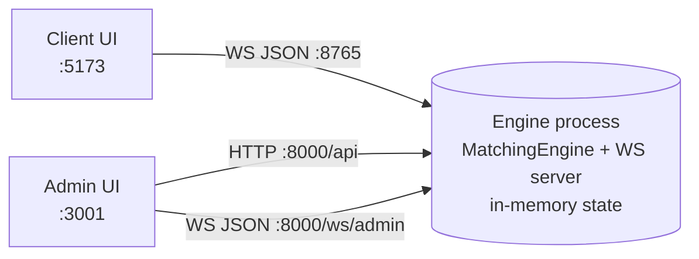

# Architecture

Hệ thống gồm **3 process** chạy song song, giao tiếp qua HTTP + WebSocket. Không có database, không có message queue, không có cache/file storage — state nằm toàn bộ trong process của engine (in-memory).

## Component

### 1. Engine (Backend)
- **Path**: `matching-engine/exchange/engine/src/engine/`
- **Stack**: Python 3.14 + `uv`, FastAPI + `uvicorn`, thư viện `websockets`, `simplefix`.
- **Trách nhiệm**: Chạy matching engine trung tâm, expose REST admin API + 2 WebSocket (admin & client). Là process duy nhất giữ state (order books, trades, configs, comm logs).
- **Entry**: `engine/main.py` — tạo `MatchingEngine` + `ExchangeWSServer`, truyền cả hai vào `create_app(...)` rồi `uvicorn.run` ở `0.0.0.0:8000`. Client WS server chạy song song ở `0.0.0.0:8765`, được `start()` trong FastAPI lifespan.
- **Sub-module nội bộ**:
  - `api.py` — FastAPI app: REST `/api/*` + WS `/ws/admin` (snapshot admin_state mỗi 0.5s).
  - `ws_server.py` — WebSocket server cho client: nhận JSON `new_order` / `subscribe`, broadcast `market_snapshot` / `market_update` / `trade` / `execution_report`.
  - `matching.py` — `MatchingEngine`: route order theo symbol, kiểm market mở, giữ `_trades`.
  - `order_book.py` — `OrderBook`: match theo price-time priority (best price trước, FIFO trong cùng giá theo thứ tự `append` vào `deque`).
  - `config.py` — `StockConfig` (floor/ceiling/price_step/qty_step) + `ExchangeConfig` (market state, 3 stock mặc định: ACB, FPT, VCK).
  - `models.py` — dataclass + enum: `Order`, `Trade`, `ExecutionReport`, `Side`, `OrdType`, `OrdStatus`, `ExecType`, `MarketState`.
  - `fix_codec.py` — encode/decode FIX 4.4 qua `simplefix` (chỉ dùng để render log human-readable; client vẫn nói JSON).

### 2. Admin UI
- **Path**: `matching-engine/exchange/admin/`
- **Stack**: React 19 + Vite, không có state library ngoài (dùng `useState`/`useRef`).
- **Trách nhiệm**: Giao diện vận hành. Đọc snapshot toàn hệ qua `ws://localhost:8000/ws/admin` (polling server-side 0.5s), thực thi lệnh điều khiển qua REST `http://localhost:8000/api/*`.
- **Dev port**: 3001.
- **Chức năng chính** (1 component = 1 panel):
  - `components/MarketControl.jsx` — nút Start/Stop market.
  - `components/StockConfig.jsx` — sửa floor/ceiling/price_step/qty_step cho từng stock.
  - `components/OrderBookView.jsx` — hiển thị books tất cả stock.
  - `components/TradeHistory.jsx` — lịch sử trade.
  - `components/CommLogs.jsx` — log FIX (IN/OUT) giữa engine và client.
  - `components/ClientCount.jsx` — số client WS đang kết nối.
- **Data flow UI**:
  - `hooks/useAdminWebSocket.js` — kết nối `ws/admin`, lưu `state` là object `admin_state` mới nhất.
  - `hooks/useAdminApi.js` — wrapper `fetch` với `API_BASE = http://localhost:8000/api`.

### 3. Client UI
- **Path**: `matching-engine/client/`
- **Stack**: React 19 + Vite, thêm `recharts` để vẽ price chart.
- **Trách nhiệm**: Nơi trader đặt lệnh và xem market data. Kết nối duy nhất 1 WebSocket `ws://localhost:8765`, không gọi REST.
- **Dev port**: 5173.
- **Chức năng**:
  - `components/OrderEntry.jsx` — form đặt lệnh LIMIT/MARKET, có auto-generator random order theo interval.
  - `components/MarketData.jsx` — order book (top 8 level mỗi bên) cho ACB/FPT/VCK.
  - `components/TradeView.jsx` — list trade gần nhất.
  - `components/PriceChart.jsx` — chart giá trade theo thời gian.
- **Data flow UI**:
  - `hooks/useWebSocket.js` — quản lý socket đến `8765`, auto-reconnect 2s, giữ 4 state: `snapshots` (per-symbol config + last_trade), `orderBooks` (bids/asks từng symbol), `trades` (≤200), `execReports` (≤100).

## Giao tiếp giữa component

- Client ↔ Engine: duy nhất WebSocket; payload JSON nhưng server log dưới dạng FIX 4.4 qua `fix_codec`.
- Admin ↔ Engine REST: `/api/market/{start,stop,state}`, `/api/stocks`, `/api/stocks/{symbol}` (PUT), `/api/orderbook/{symbol}`, `/api/trades`, `/api/logs`, `/api/clients`.
- Admin ↔ Engine WS: 1 chiều server→client, push `admin_state` mỗi 0.5s (không consume message từ admin).

## Persistence / External
- **Database**: không có. Tất cả order book, trade, log lưu trong `MatchingEngine` + `ExchangeWSServer` (RAM).
- **Restart engine = mất hết state** — kể cả config stock đã chỉnh qua Admin.
- **External service / queue / cache / file storage**: không có.
- **Log file**: khi chạy qua `startall.sh/.ps1`, stdout/stderr của mỗi service ghi vào `.run/{engine,admin,client}.log` + PID file `.run/*.pid`. Không phải persistence của domain data.
