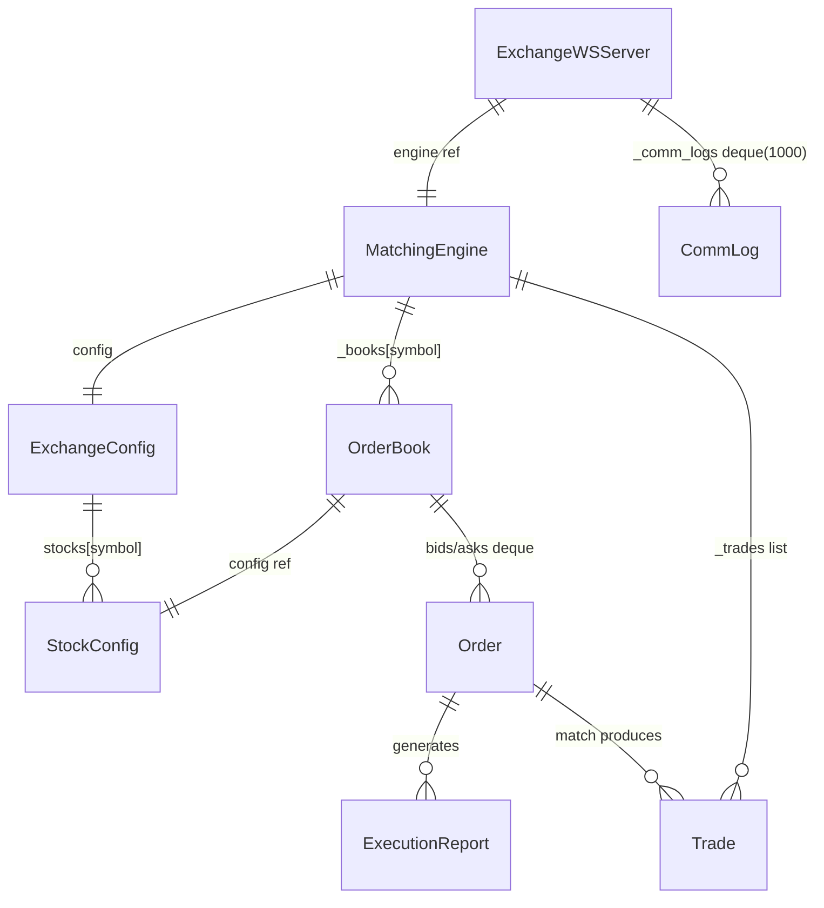

# Data Model

**No persistence layer.** Không có DB, ORM, file-based store. Toàn bộ state sống trong tiến trình `engine` (dict + list + deque) và state React của UI. Restart engine → mất hết.

Dưới đây là các data structure trung tâm code thực sự dùng.

## Domain entity (Python — `exchange/engine/src/engine/models.py`)

### `Order` (dataclass)
| field | type | ghi chú |
|---|---|---|
| `cl_ord_id` | `str` | ID client tự sinh, duy nhất per request |
| `account` | `str` | tên tài khoản (free-form, không validate) |
| `symbol` | `str` | đã `.upper()` trước khi vào engine |
| `side` | `Side` | `BUY` / `SELL` |
| `ord_type` | `OrdType` | `LIMIT` / `MARKET` |
| `price` | `int` | VND, `0` cho MARKET |
| `quantity` | `int` | qty gốc, không đổi sau khi đặt |
| `order_id` | `str` | engine gán: `ORD-{symbol}-{counter}` |
| `status` | `OrdStatus` | `NEW` → `PARTIALLY_FILLED` → `FILLED` / `CANCELLED` / `REJECTED` |
| `filled_qty` | `int` | tổng qty đã khớp |
| `leaves_qty` | `int` | = `quantity - filled_qty`, set trong `__post_init__` nếu 0 |
| `avg_px` | `float` | giá trung bình weighted theo qty |
| `timestamp` | `float` | `time.time()` mặc định |

Method: `fill(qty, price)`, `cancel()`, `reject()`; property `cum_qty` = `filled_qty`.

### `Trade` (dataclass)
`trade_id` (= `TRD-{symbol}-{counter}`), `symbol`, `price`, `quantity`, `buy_order_id`, `sell_order_id`, `buy_cl_ord_id`, `sell_cl_ord_id`, `timestamp`.

### `ExecutionReport` (dataclass)
`cl_ord_id`, `order_id`, `exec_id` (= `EXEC-{symbol}-{counter}` hoặc `EXEC-REJ-*` cho reject sớm), `exec_type` (`NEW|TRADE|CANCELLED|REJECTED`), `ord_status`, `symbol`, `side`, `price`, `quantity`, `leaves_qty`, `cum_qty`, `avg_px`, `last_px`, `last_qty`, `reject_reason`.

### Enum
`Side {BUY, SELL}`, `OrdType {LIMIT, MARKET}`, `OrdStatus {NEW, PARTIALLY_FILLED, FILLED, CANCELLED, REJECTED}`, `ExecType {NEW, TRADE, CANCELLED, REJECTED}`, `MarketState {CLOSED, OPEN}`.

## Config (`config.py`)

### `StockConfig` (dataclass)
`symbol`, `floor: int`, `ceiling: int`, `price_step: int`, `qty_step: int`.
Method: `validate_price(p)` (kiểm floor ≤ p ≤ ceiling và `(p-floor) % price_step == 0`), `validate_quantity(q)` (`>0` và `% qty_step == 0`).

### `ExchangeConfig`
- `market_state: MarketState` — mặc định `CLOSED`.
- `stocks: dict[str, StockConfig]` — clone từ `DEFAULT_STOCKS`:
  - `ACB`: floor=20000, ceiling=30000, price_step=100, qty_step=100.
  - `FPT`: floor=50000, ceiling=75000, price_step=500, qty_step=100.
  - `VCK`: floor=10000, ceiling=15000, price_step=100, qty_step=100.

## In-memory state

### `MatchingEngine` (`matching.py`)
- `config: ExchangeConfig`.
- `_books: dict[str, OrderBook]` — key là `symbol` upper, init 1 book / stock lúc ctor.
- `_trades: list[Trade]` — append thêm sau mỗi `submit_order` thành công. Nguồn sự thật duy nhất cho lịch sử trade.

### `OrderBook` (`order_book.py`)
- `config: StockConfig` (reference trực tiếp tới object trong `ExchangeConfig.stocks`).
- `_bids: dict[int, deque[Order]]` — key = price; deque chứa order còn leaves_qty > 0.
- `_asks: dict[int, deque[Order]]` — tương tự.
- Counters: `_order_counter`, `_trade_counter`, `_exec_counter` (đều `itertools.count(1)`, per-book).
- Helper: `bids()` / `asks()` trả `list[tuple[price, total_qty)]` sorted (bid desc, ask asc); `best_bid` / `best_ask`.

### `MatchResult` (dataclass, transient)
Trả về từ `OrderBook.process_order`: `trades: list[Trade]`, `exec_reports: list[ExecutionReport]`, `book_updates: list[dict]` (mỗi dict có `symbol`, `side`, `price`, `quantity` — quantity tổng của level sau khi match).

### `ExchangeWSServer` (`ws_server.py`)
- `_clients: dict[ServerConnection, str]` — map WebSocket → `CLIENT-{n}`.
- `_client_counter: int` — monotonic.
- `_comm_logs: deque[CommLog]` — **bounded `maxlen=1000`** (chống leak memory).
- `_server: Server | None` — handle websockets server.

### `CommLog` (dataclass)
`timestamp`, `direction` (`"IN"`/`"OUT"`), `client_id`, `message_type`, `summary`, `fix_raw` (đoạn FIX đã decode human).

## Wire format (không phải persistence, nhưng là data shape cross-boundary)

### Client ↔ Engine (JSON, `ws://:8765`)
- Inbound: `{ type: "new_order", cl_ord_id, account, symbol, side, ord_type, price, quantity }` hoặc `{ type: "subscribe" }`.
- Outbound per snapshot: `{ type: "market_snapshot", symbol, floor, ceiling, price_step, qty_step, market_state, sequence, bids: [[p, q]], asks: [[p, q]], last_trade }`.
- Outbound update: `market_update` (1 level), `trade`, `execution_report`, `error`.

### Admin WS (JSON, `ws://:8000/ws/admin`)
- Server push mỗi 0.5s: `{ type: "admin_state", market_state, stocks, books, trades, logs, client_count }`.

## Data shape trong UI

### Client (`client/src/hooks/useWebSocket.js`)
- `snapshots: { [symbol]: market_snapshot }` — lấy từ type `market_snapshot`.
- `orderBooks: { [symbol]: { bids: [[p,q]], asks: [[p,q]] } }` — tự patch khi nhận `market_update` (xoá level nếu qty=0, update/insert rồi re-sort).
- `trades: [trade, ...]` — giới hạn 200, mới nhất ở đầu.
- `execReports: [er, ...]` — giới hạn 100, mới nhất ở đầu.

### Admin (`exchange/admin/src/hooks/useAdminWebSocket.js`)
- `state: admin_state | null` — ghi đè toàn bộ mỗi tick 0.5s. Component đọc qua optional chain (`state?.market_state`, `state?.books`, …).

## Quan hệ giữa các structure

Lưu ý: `OrderBook.config` là **reference** tới `ExchangeConfig.stocks[symbol]`, nên khi Admin sửa stock, book dùng ngay giá trị mới (`update_stock_config` cũng gán lại để phòng trường hợp symbol lệch).
