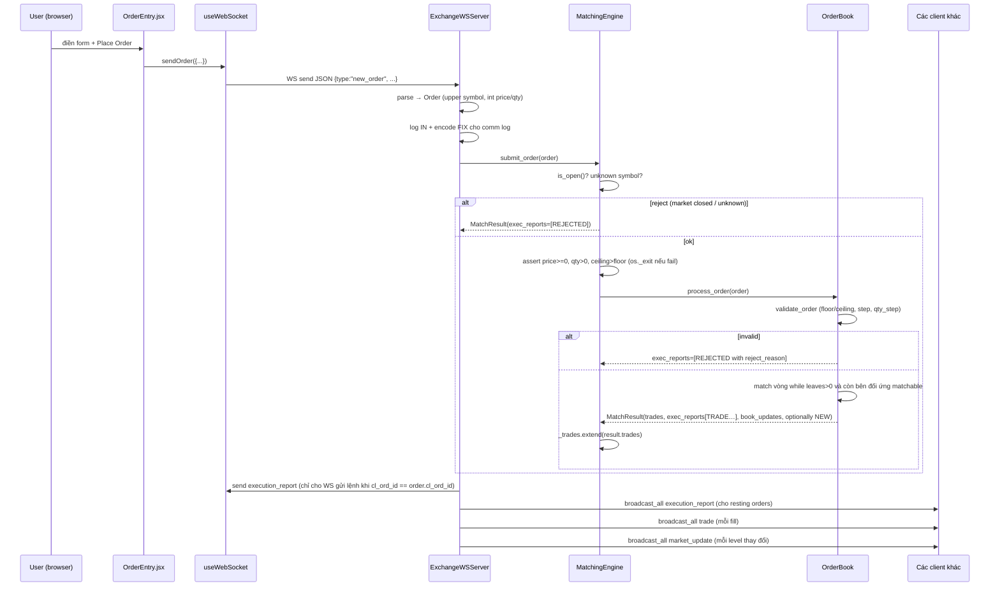

# Flows

Không có auth/authorization — bất kỳ ai mở được port đều vào được. Dưới đây là các flow code thực sự implement.

## 1. Khởi tạo stack

1. `main.main()` (`engine/main.py`) gọi `MatchingEngine()` → ctor `ExchangeConfig()` với `market_state=CLOSED`, clone 3 stock mặc định (ACB/FPT/VCK) thành `StockConfig`, rồi init `OrderBook` cho mỗi symbol.
2. Tạo `ExchangeWSServer(engine=...)` (chưa start server, chỉ chuẩn bị state) và gọi `create_app(engine, ws_server)`.
3. `create_app` lifespan startup: `await ws_server.start()` → `websockets.serve(self._handle_client, host, 8765)`.
4. `uvicorn.run(app, host=0.0.0.0, port=8000)` — FastAPI HTTP + `/ws/admin` sẵn sàng.

> Ghi chú: `main.py` không dùng `asyncio.run` — `uvicorn.run` tự tạo event loop và quản lý lifespan. Client WS server và HTTP server cùng loop, cùng process.

## 2. Admin mở/đóng market

Bước theo code path (`exchange/admin/src/App.jsx` → REST → engine):

- Admin click **Start Market** → `MarketControl.onStart` → `useAdminApi.startMarket()` → `fetch POST http://localhost:8000/api/market/start`.
- Endpoint `start_market` (trong `api.create_app`) gọi `engine.config.open_market()` → `market_state = OPEN`, trả `{state: "OPEN"}`.
- Admin WS (đang poll 0.5s) push `admin_state` mới; UI tự cập nhật badge.
- Stop market: flow đối xứng qua `/api/market/stop` → `close_market()`.

## 3. Admin sửa stock config

- `StockConfig` component cho edit inline, click **Save** → `useAdminApi.updateStock(symbol, data)` → `PUT /api/stocks/{symbol}` với body là patch (chỉ field `!= null`).
- Server validator Pydantic (`StockConfigUpdate`) đảm bảo value `> 0`.
- Endpoint lọc field `None`, nếu rỗng trả 400. Gọi `engine.update_stock_config(symbol.upper(), **updates)`:
  - Tìm `StockConfig` trong `config.stocks`, setattr các key `floor/ceiling/price_step/qty_step`.
  - Gán lại `self._books[symbol].config = stock` để chắc chắn book dùng config mới.
- Trả 200 với config cập nhật. Order đang nằm trên book **không bị revalidate** — chỉ order mới chịu rule mới.

## 4. Client connect + nhận snapshot

1. Trình duyệt mở Client UI (5173). `useWebSocket` mở `ws://localhost:8765`.
2. Server `ExchangeWSServer._handle_client`:
   - Cấp `client_id = CLIENT-{n}` (counter monotonic), thêm vào `_clients[ws]`.
   - Log `IN connect`.
   - `_build_market_snapshot()`: iterate toàn bộ book, lấy `config + last trade + bids + asks`, gửi **1 message `market_snapshot` / symbol**.
   - Log `OUT snapshot`.
3. Client hook ghi nhận vào `snapshots[symbol]` và `orderBooks[symbol]`.

## 5. Đặt lệnh (main business flow)

Chi tiết match trong `OrderBook.process_order` (`order_book.py:95`):

- Gán `order_id = ORD-{symbol}-{n}`.
- `validate_order`: nếu LIMIT thì check price; luôn check qty. Fail → `order.reject()` + exec report `REJECTED`, return.
- `_match(incoming, result)`:
  - Chọn side đối diện, `price_key = min` (nếu BUY) hoặc `max` (nếu SELL).
  - Lặp best price → matchable? Nếu `MARKET` thì matchable mọi giá; LIMIT phải thoả giá.
  - Với mỗi queue tại `best_price`, lấy `queue[-1]` (order đang ở cuối queue sau `append`), `fill_qty = min(leaves)`, `fill_price = incoming.price` nếu limit có price, còn không lấy `best_price`.
  - Gọi `incoming.fill(...)` và `resting.fill(...)` → cập nhật `filled_qty`, `leaves_qty`, `avg_px`, `status`.
  - Tạo `Trade`, 2 `ExecutionReport` (type `TRADE`) cho cả 2 bên.
  - Nếu resting filled hết → `queue.pop()`.
  - Khi queue rỗng → `del opposite[best_price]`. Push `book_update` (level đối diện sau match).
- Sau match: nếu `leaves_qty > 0`:
  - MARKET: `order.cancel()` + exec report `CANCELLED`.
  - LIMIT: `_add_to_book` (append vào `deque` tại giá đó). Nếu status vẫn `NEW` → exec report `NEW`. Push `book_update` cho level resting.

Sau khi `submit_order` return, `ws_server` xử lý kết quả:

- Với mỗi `exec_report`: nếu `cl_ord_id == order.cl_ord_id` (báo cáo của chính lệnh vừa đặt) → gửi riêng cho socket đặt lệnh; còn lại (báo cáo của resting counter-party) → `_broadcast_json_all`. Log FIX `execution_report`.
- Với mỗi trade → `_broadcast_json_all {type:"trade", ...}`, log OUT.
- Với mỗi book update → `_broadcast_json_all {type:"market_update", ...}`.

## 6. Auto order generator (Client side)

- `OrderEntry` có chế độ `autoGen` + `autoInterval` (min 100 ms).
- Mỗi tick: pick random symbol/side, đọc snapshot đó để biết `floor/ceiling/price_step/qty_step`, chọn giá nằm trong range, qty = random 1..5 × `qty_step`, gửi bằng `sendOrder`.
- Không có rate limit server — nếu interval quá nhỏ dễ flood comm log (deque 1000 sẽ rotate).

## 7. Admin WebSocket telemetry

- Kết nối `ws://localhost:8000/ws/admin`.
- Server loop (trong `admin_websocket`): cứ 0.5s gọi `_get_admin_state(engine, ws_server)` → JSON → `send_text`. Không consume message từ admin client.
- `_get_admin_state` build: `market_state`, `stocks` (dict symbol→config), `books` (dict symbol→{bids, asks}), `trades` (toàn bộ `engine._trades`), `logs` (100 entry cuối trong `_comm_logs`), `client_count`.
- Khi admin UI disconnect, try/except `WebSocketDisconnect|Exception` và pass — không cleanup gì thêm.

## 8. Engine stop

- `startall.sh/.ps1` dùng `stopall.sh/.ps1` để kill theo PID file `.run/*.pid`; engine bị SIGTERM, FastAPI lifespan shutdown → `ws_server.stop()` đóng server websockets.
- Không persist gì — lần chạy sau bắt đầu lại từ state mặc định.
