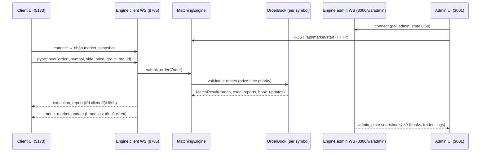

# Project Context — Exchange Matching Engine (Hackathon 1h / 4 người)

## 1. Run & Verify

Tất cả lệnh chạy từ `matching-engine/` (trừ khi nói rõ).

```bash
# Install deps (mỗi service 1 lần)
cd exchange/engine && uv sync && cd ../..
cd exchange/admin  && npm install && cd ../..
cd client          && npm install && cd ..

# Start all (từ matching-engine/)
./startall.sh            # macOS/Linux
.\startall.ps1           # Windows PowerShell

# Manual start từng service
cd exchange/engine && uv run python -m engine.main   # engine: 8000 (HTTP + /ws/admin), 8765 (client WS)
cd exchange/admin  && npm run dev                     # admin UI: 3001
cd client          && npm run dev                     # client UI: 5173

# Smoke test
curl http://localhost:8000/api/market/state            # {"state":"CLOSED"}
curl -X POST http://localhost:8000/api/market/start    # mở market
```

## 2. Module Map

| path | trách nhiệm | owner |
|---|---|---|
| `exchange/engine/src/engine/main.py` | Entry point; dựng engine + ws_server + FastAPI app |  |
| `exchange/engine/src/engine/api.py` | REST admin + `/ws/admin` (snapshot toàn hệ state mỗi 0.5s) |  |
| `exchange/engine/src/engine/ws_server.py` | WS client (8765): nhận order JSON, broadcast trade/book |  |
| `exchange/engine/src/engine/matching.py` | `MatchingEngine` — kiểm market/symbol, route tới order book |  |
| `exchange/engine/src/engine/order_book.py` | Order book per-symbol: validate, match, place remainder |  |
| `exchange/engine/src/engine/config.py` | `StockConfig` (floor/ceiling/step), `ExchangeConfig`, market state |  |
| `exchange/engine/src/engine/models.py` | Order/Trade/ExecutionReport/enums (Side, OrdType, OrdStatus…) |  |
| `exchange/engine/src/engine/fix_codec.py` | Encode/decode FIX 4.4 (chỉ dùng cho log human-readable) |  |
| `exchange/engine/tests/` | pytest suite: matching, order_book, api, ws, fix, models |  |
| `exchange/admin/src/` | Admin UI (React+Vite): market control, stock config, order book view, trade history, comm logs |  |
| `client/src/` | Client UI (React+Vite): order entry, market data, trade view, price chart |  |

## 3. Luồng chính



## 4. Top Invariants (ĐỪNG PHÁ khi fix bug)

- Duy nhất 1 instance `MatchingEngine` được share giữa REST API (`app.state.engine`) và client WS (`ws_server.engine`) — tạo từ `main.py` rồi truyền vào `create_app`.
- Order chỉ được accept khi `engine.config.is_open()` trả True; trước đó phải reject với `Market is closed`.
- Symbol luôn `.upper()` ở mọi entry point (HTTP handler, WS `_handle_new_order`) — key trong `engine._books` là UPPER.
- Mọi `Order` phải qua `OrderBook.validate_order` (floor/ceiling, price_step, qty_step) trước khi match; price `<0` hoặc qty `<=0` làm engine `os._exit(1)`.
- `engine._trades` là nguồn sự thật duy nhất cho lịch sử giao dịch — được `get_trades()` đọc cho cả REST, market snapshot và admin state.
- Client WS dùng `_broadcast_json_all` cho mọi `trade` và `market_update` — tất cả client đều thấy cùng một thứ tự event.
- `CommLog` là `deque(maxlen=1000)` — không được thay bằng list unbounded (memory leak trong demo dài).
- Dùng lại instance `ws_server` đã tạo trong `main.py` khi truyền cho `create_app`; lifespan chịu trách nhiệm `start()`/`stop()` đúng 1 lần.

## 5. Demo Script

1. `cd matching-engine && ./startall.sh` (hoặc `.\startall.ps1`) → đợi 3 URL sẵn sàng: 3001, 5173, 8000.
2. Mở Admin `http://localhost:3001` → bấm **Start Market** → state hiển thị `OPEN`; kiểm tra stocks mặc định (ACB, FPT, VCK).
3. Mở 2 tab Client `http://localhost:5173` → mỗi tab đặt 1 lệnh ngược chiều cho cùng symbol (vd ACB BUY 20100 × 100 và ACB SELL 20100 × 100, đúng price_step=100, qty_step=100).
4. Verify: cả 2 tab client thấy `trade` + `market_update`; Admin UI thấy trade mới trong Trade History và comm log FIX tương ứng.
5. Verify bug đã fix: <thực hiện kịch bản tái hiện bug từ bug list rồi xác nhận behavior đúng> _(placeholder — điền theo bug ticket thực tế)_.
6. Dừng stack: `./stopall.sh` (hoặc `.\stopall.ps1`) → xác nhận không còn port 8000/8765/3001/5173 nào bị giữ.

"Bản rút gọn cho hackathon 1h. Chi tiết xem source + bug list."
